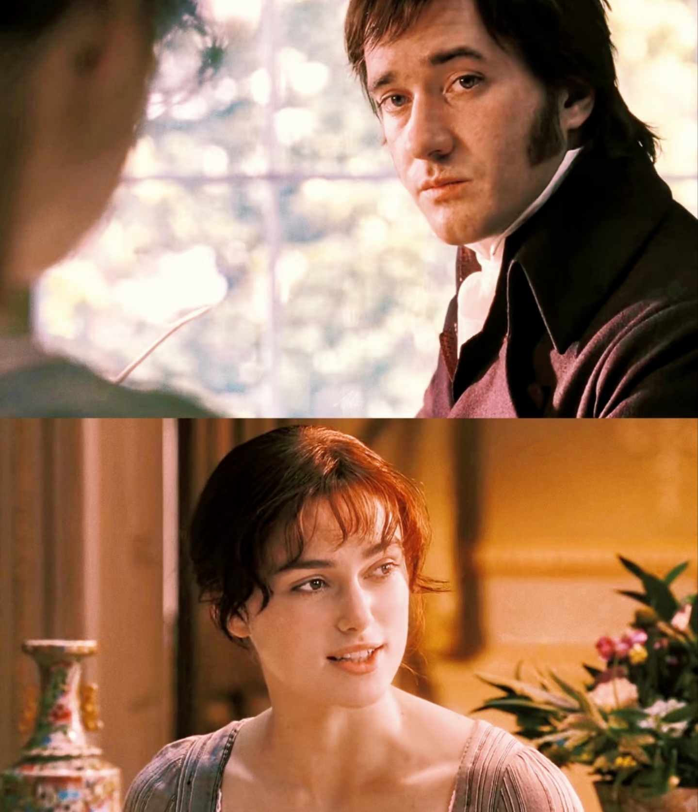
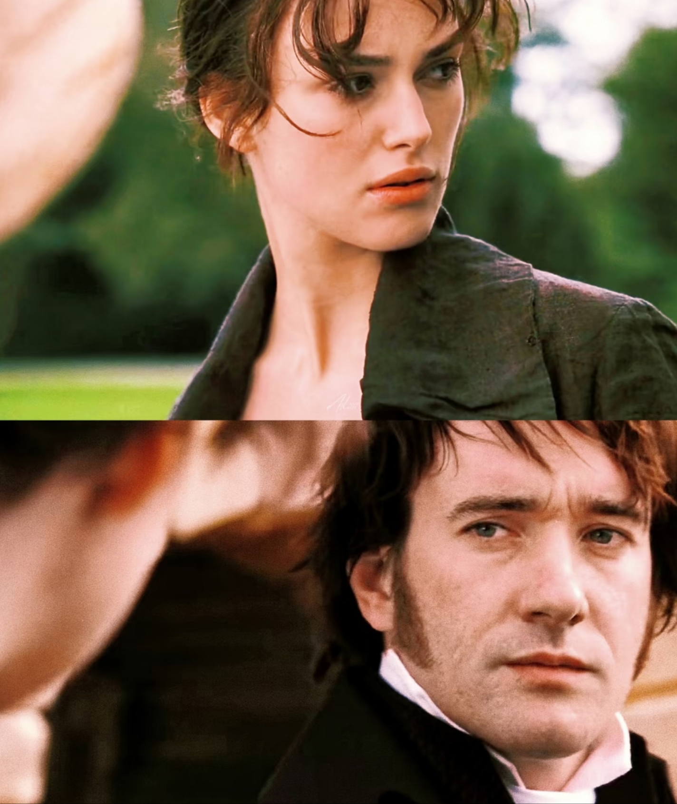
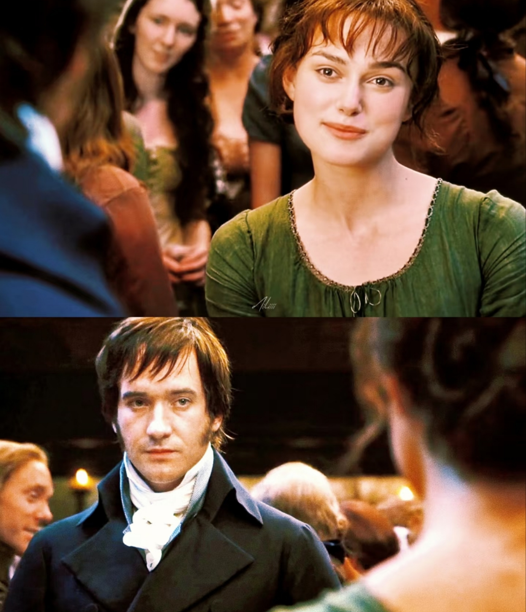
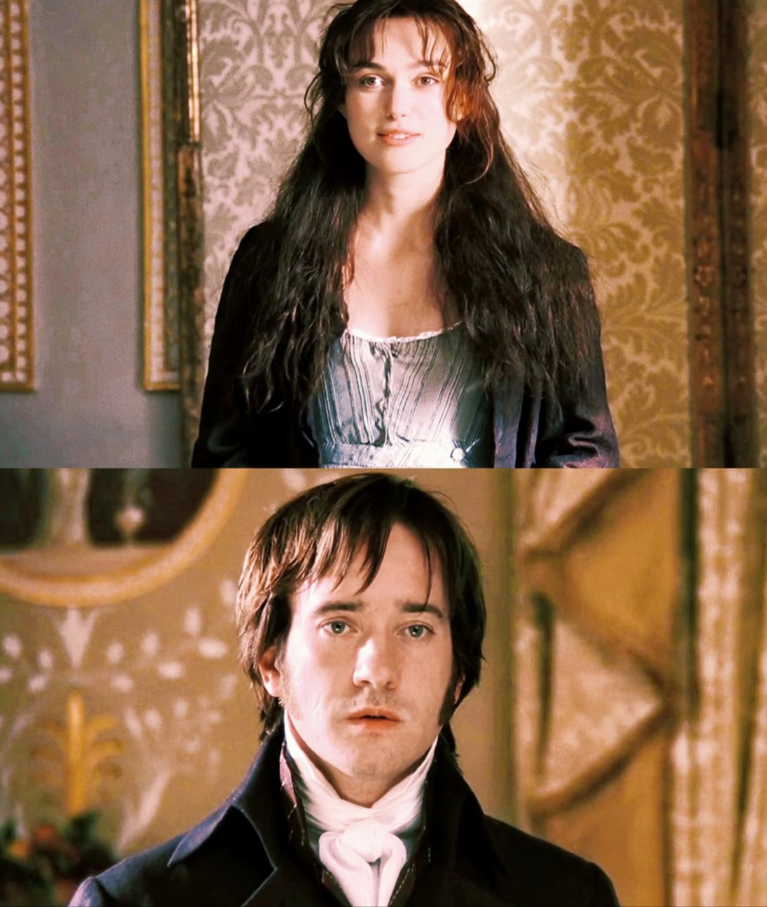

## APIs-1

在以后变量声明先用const，尤其是数组和对象

### 1.web API的基本认知

#### 1.作用和分类

作用：就是使用js来操作浏览器和html标签

分类：DOM（文档对象模型），BOM（浏览器对象模型）


关于DOM：用来呈现以及与任意html或者xml文档交互的API；作用是开发网页内容特效以及实现用户交互

#### 2.DOM树

将html文件以树状结构表示出来，我们称之为文档树或DOM树，它是描述网页内容关系的名词；能够更直观地体现标签之间的关系


#### 3.DOM对象

其实是浏览器根据html标签生成的js对象

1.所有的标签对象都可以在这个对象上面找到

2.修改这个对象的属性会自动映射到标签身上

DOM的**核心思想**是将网页内容当作对象来处理

**document对象**是DOM里提供的一个对象，所以他提供的属性和方法都是用来访问和操作网页内容的，比如document.write()，而网页所有的内容都在document里面

### 2.获取DOM对象

##### 1.通过css选择器来获取DOM对象

1.获取匹配的第一个元素

​	**css里面怎么写，引号里面就怎么写**，简而言之，' '里面就是css选择器，可以写后代选择器等；

返回值：

​	返回css选择器匹配的第一个元素，即一个htmlElement对象

​	如果没有匹配到的话，就会返回null

```js
document.querySelector('css选择器')
//
<div class="box"></div>
    <p id="nav">xixixi</p>
    <script>
        const box = document.querySelector('.box')
        console.log(box)
        const nav =document.querySelector('#nav')
        console.log(nav) 
    </script>
```

2.选择匹配的多个元素

返回值：

​	返回匹配的NodeList对象合集，这其实是一个伪数组，它有长度和索引号，但是没有push()等数组方法，所以想要得到里面的每一个对象，则需要遍历(for)的方式

```js
const lis = document.querySelectorAll('.nav li')
        for(let i = 0;i<lis.length;i++) {
            console.log(lis[i])
            lis[i].style.color= 'green'
        }
```

##### 2.通过其他方式获取DOM对象


### 3.操作元素内容

DOM对象都是根据标签生成的，所以操作标签本质上就是操作DOM对象；

操作对象使用点语法：

```js
div.style.color = 'red'
```

如果想要修改标签元素里面的内容，可以使用以下几种方式：

##### 1.对象.innerText属性

将文本内容添加或更新到任意标签位置

显示纯文本，不解析标签

```js
const box = document.querySelector('.box')
console.log(box.innerText)
box.innerText = '我是盒子'
console.log(box.innerText)
```

##### 2.对象.innerHTML属性

会解析标签，多标签建议使用模板字符

```js
const box1 = document.querySelector('.box1')
console.log(box1.innerHTML)
box1.innerHTML='<strong>我是innerHTML</strong>'
console.log(box1.innerHTML)
```

### 4.操作元素属性

#### 1.操作元素常用属性

常见的属性包括：href, title, src等

```js
对象.属性 = 值
```

#### 2.操作元素样式属性

学习路径：

**通过style属性操作css**

生成的是行内样式表，权重比较高

```js
对象.style.样式属性 = 值
```

```js
<div class="box"></div>
    <script>
        const box = document.querySelector('.box')
        box.style.width = '300px'//字符串加单位
        box.style.backgroundColor='hotpink'//-用大写代替
    </script>
```

多种情况用小驼峰命名法

**操作类名（className）操作css**

修改的样式比较多的话直接通过style属性修改就会很繁琐，这时候就要使用css类名的方式

```js
//active是一个css类名
元素.className = 'active'
```

className是使用新值换旧值，如果需要添加一个类，需要保留之前的类名

```js
<div class="nav">
    123
</div>
<script>
    const div = document.querySelector('div')
	div.className = 'nav box'
</script>
```

**通过classList操作类控制css**

为了解决className容易覆盖以前的类名，我们可以通过classList方式追加和删除类名

```js
const box = document.querySelector('.box')
box.classList.add('active')//类名不加点
box.classList.remove('box')//删除
box.classList.toggle('active')//有就删掉，没有就加上
```

#### 3.操作表单元素属性

获取：DOM对象.属性名

设置：DOM对象.属性名 = 新值

```js
表单.value = '用户名'
表单.type = 'password'
```

表单属性中添加就有效果，移除就没有效果，一律使用布尔值表示，是true和false

比如：disabled ,checked ,selected

```js
<input type="checkbox" name="" id="">
<button>点击</button>
<script>
	const ipt = document.querySelector('input')
	ipt.checked = true  //勾选
	const button = document.querySelector('button')
	button.disabled = true  //禁用点击
</script>
```

#### 4.自定义属性

标准属性是标签自带的属性，比如class id title等，可以直接使用点语法操作比如：disabled，checked，selected等

自定义属性：

​	在html5推出来了专门的data-自定义属性

​	标签一律以data-开头

​	在DOM对象上一律以dataset对象方式获取

```js
<div data-id="5" data-spm='buzhi'>5</div>
    <script>
        const one = document.querySelector('div')
        console.log(one.dataset)//set是集合的意思
		console.log(one.dataset.spm)
    </script>
```

#### 5.定时器-间歇函数

网页中用到的一种功能：每隔一段时间需要自动执行一段代码，不需要我们手动触发

**开启定时器**

```js
setInterval(函数,间隔时间)  //开启定时器，间隔时间的单位是毫秒
```

```js
setInterval(function(){
    console.log('一秒钟打印一次')
},1000)
有名函数
function fn() {
    console.log('2')
}
let n = setInterval(fn,100)或者         
setInterval('fn()',100)
```

开启定时器时函数名字不需要加括号，返回的是一个id数据

**关闭定时器**

```js
let n = setInterval(fn,1000)
clearInterval(n)
```

### 5.案例


## APIs-2

### 1.事件监听（绑定）

#### 1.事件监听

事件是在编程时系统内发生的动作或事情

事件监听是让程序检测是否有事件产生，一旦有事件触发，就立即调用一个函数做出响应，也称为绑定事件或者注册事件，比如鼠标经过显示下拉菜单等

```js
元素对象.addEventListener('事件类型',要执行的函数)
```

**三要素：**

事件源：要获取被事件触发的dom元素

事件类型：用什么方式触发，比如鼠标单击click，鼠标经过mouseover等

事件调用的函数：要做什么事

**注意：**

事件类型要加引号；函数是点击一次触发一次

#### 2.案例


```html
<!DOCTYPE html>
<html lang="en">

<head>
    <meta charset="UTF-8">
    <meta name="viewport" content="width=device-width, initial-scale=1.0">
    <title>Document</title>
    <style>
        * {
            margin: 0;
            padding: 0;
        }

        h2 {
            text-align: center;
        }

        .box {
            width: 600px;
            margin: 50px auto;
            display: flex;
            font-size: 25px;
            line-height: 40px;

        }

        .qs {
            width: 450px;
            height: 40px;
            color: red;
        }

        .btns {
            text-align: center;
        }

        .btns button {
            width: 120px;
            height: 35px;
            margin: 0 50px;
        }
    </style>
</head>

<body>
    <h2>随机点名</h2>
    <div class="box">
        <span>名字是：</span>
        <div class="qs">这里显示姓名</div>
    </div>
    <div class="btns">
        <button class="start">开始</button>
        <button class="end">结束</button>
    </div>
    <script>
        const arr = ['马超', '黄忠', '赵云', '关羽', '张飞']
        //声明，便于关闭按钮
        let timeID = 0
        //随机号要全局变量
        let random = 0
        //1.开始按钮
        const start = document.querySelector('.start')
        const qs = document.querySelector('.qs')
        start.addEventListener('click', function () {
            timeID = setInterval(function () {
                random = Math.floor(Math.random() * arr.length)
                qs.innerHTML = arr[random]
            }, 100)
            //如果数组里面只有一个值了，那就不需要抽了
            if (arr.length === 1) {
                start.disabled = end.disabled = true
            }
        })

        //2.关闭按钮
        const end = document.querySelector('.end')
        end.addEventListener('click', function () {
            clearInterval(timeID)
            //结束了之后就要删除
            arr.splice(random, 1)
        })
    </script>
</body>

</html>
```

#### 3.事件监听版本

1.第一个版本，缺点是会被覆盖；只能做冒泡，不能做捕获

```js
	<button>点击</button>
    <script>
        const btn = document.querySelector('button')
        btn.onclick = function () {
            alert('11')
        }
        btn.onclick = function () {
            alert('22')
        }
        //显示22，说明上方的被覆盖
    </script>
```

2.第二个版本，捕获和冒泡都能做

```js
btn.addEventListener('click',function() {
            alert('33')
        })
btn.addEventListener('click',function() {
            alert('44')
        })
```

### 2.事件类型


鼠标：

```js
		const div = document.querySelector('div')
        div.addEventListener('mouseenter', function () {
            console.log('轻轻的我来了')
        })
        div.addEventListener('mouseleave', function () {
            console.log('轻轻的我走了')
        })
```

焦点：

```js
        const input = document.querySelector('input')
        input.addEventListener('focus', function () {
            console.log('有焦点触发')
        })
        input.addEventListener('blur', function () {
            console.log('失去焦点触发')
        })
```

键盘：

```js
         input.addEventListener('keydown', function () {
             console.log('键盘按下了')
         })
         input.addEventListener('keyup', function () {
             console.log('键盘弹起了')
         })
```

文本：

```js
        input.addEventListener('input',function(){
            console.log(input.value)
        })
```

#### 案例


代码：

```html
<!DOCTYPE html>
<html lang="en">

<head>
    <meta charset="UTF-8">
    <meta name="viewport" content="width=device-width, initial-scale=1.0">
    <title>Document</title>
    <style>
        .wrapper {
            min-width: 400px;
            max-width: 800px;
            display: flex;
            justify-content: flex-end;
        }

        .avatar {
            width: 48px;
            height: 48px;
            border-radius: 50%;
            overflow: hidden;
            background: url(./images/avatar.jpg) no-repeat center / cover;
            margin-right: 20px;
        }

        .wrapper textarea {
            outline: none;
            border-color: transparent;
            resize: none;
            background: #f5f5f5;
            border-radius: 4px;
            flex: 1;
            padding: 10px;
            transition: all 0.5s;
            height: 30px;
        }

        .wrapper textarea:focus {
            border-color: #e4e4e4;
            background: #fff;
            height: 50px;
        }

        .wrapper button {
            background: #00aeec;
            color: #fff;
            border: none;
            border-radius: 4px;
            margin-left: 10px;
            width: 70px;
            cursor: pointer;
        }

        .wrapper .total {
            margin-right: 80px;
            color: #999;
            margin-top: 5px;
            opacity: 0;
            transition: all 0.5s;
        }

        .list {
            min-width: 400px;
            max-width: 800px;
            display: flex;
        }

        .list .item {
            width: 100%;
            display: flex;
        }

        .list .item .info {
            flex: 1;
            border-bottom: 1px dashed #e4e4e4;
            padding-bottom: 10px;
        }

        .list .item p {
            margin: 0;
        }

        .list .item .name {
            color: #FB7299;
            font-size: 14px;
            font-weight: bold;
        }

        .list .item .text {
            color: #333;
            padding: 10px 0;
        }

        .list .item .time {
            color: #999;
            font-size: 12px;
        }
    </style>
</head>

<body>
    <div class="wrapper">
        <i class="avatar"></i>
        <textarea name="" id="tx" placeholder="发一条友善的评论" rows="2" maxlength="200"></textarea>
        <button>发布</button>
    </div>
    <div class="wrapper">
        <span class="total">0/200字</span>
    </div>
    <div class="list">
        <div class="item" style="display:none">
            <i class="avator"></i>
            <div class="info">
                <p class="name">清风徐来</p>
                <p class="text">大家都辛苦啦，感谢各位大大的努力，能圆满完成真是太好啦</p>
                <p class="time">2022-10-10 20:29:21</p>
            </div>
        </div>
    </div>
    <script>
        const tx = document.querySelector('#tx')
        const total = document.querySelector('.total')
        //1.当文本域获得焦点，就让total显示出来
        tx.addEventListener('focus', function () {
            total.style.opacity = 1
        })
        //2.当文本域失去焦点，就让total隐藏
        tx.addEventListener('blur', function () {
            total.style.opacity = 0
        })
        //3.检测用户输入
        tx.addEventListener('input', function () {
            // console.log(tx.value.length)
            total.innerHTML = `${tx.value.length}/200字`
        })

        //字符串也有长度
        // const str = 'andy'
        // console.log(str.length)
    </script>
</body>

</html>
```

### 3.事件对象

#### 1.获取事件对象

这个对象里有事件触发的相关信息

在事件绑定的回调函数的第一个参数就是事件对象，一般命名为event，ev，e

```js
元素.addEvevtListener('click',function(e){

})
```

#### 2.事件对象常用属性

type:获取当前的事件类型

clientX/clientY：获取光标相对于浏览器可见窗口左上角的位置

offsetX/offsetY：获取光标相对于当前DOM元素左上角的位置

key：用户按下键盘的值，现在不提倡用keyCode

```js
        const input = document.querySelector('input')
        input.addEventListener('keyup', function (e) {
            // console.log(e.key)
            if(e.key==='Enter') {
                console.log('回车键')
            }
        })
```

去除字符串两侧的空格：

```js
    <script>
        const str = '       pink     '
        console.log(str.trim())
    </script>
```

### 4.环境对象

环境对象是指函数内部特殊的变量this，**它代表着当前函数运行时所处的环境**；弄清楚this的指向会让我们代码更简洁。

```js
        function fn() {
            console.log(this)
        }
        window.fn()
//每个函数都有this 环境对象，普通函数里面this指向的是window
```

函数调用方式不同的话，this指代的对象也不同

```js
<button>点击</button>
<script>
    const btn = document.querySelector('button')
    btn.addEventListener('click', function () {
        console.log(this)    // 指向btn
    })
</script>
```

**粗略规则：谁调用，this就指向谁。**

直接调用函数就是调用window.函数，所以this指代window

### 5.回调函数

如果**将函数A作为参数传给函数B**，我们就称函数A为回调函数

```js
//定时器就很常见
function fn() {
    console.log('我是回调函数')
}
//fn传递给了setInterval, fn就是回调函数
setInterval(fn,1000)//过了一秒钟，就回去再调用
```

定时器，事件监听都使用了回调函数

### 6.案例


```html
<!DOCTYPE html>
<html lang="en">

<head>
    <meta charset="UTF-8">
    <meta name="viewport" content="width=device-width, initial-scale=1.0">
    <title>Document</title>
    <style>
        * {
            margin: 0;
            padding: 0;
        }

        .tab {
            width: 590px;
            height: 340px;
            margin: 20px;
            border: 1px solid #e4e4e4;
        }

        .tab-nav {
            width: 100%;
            height: 60px;
            line-height: 60px;
            display: flex;
            justify-content: space-between;
        }

        .tab-nav h3 {
            font-size: 24px;
            font-weight: normal;
            margin-left: 20px;
        }

        .tab-nav ul {
            list-style: none;
            display: flex;
            justify-content: flex-end;
        }

        .tab-nav ul li {
            margin: 0 20px;
            font-size: 14px;
        }

        .tab-nav ul li a {
            text-decoration: none;
            border-bottom: 2px solid transparent;
            color: #333;
        }

        .tab-nav ul li a.active {
            border-color: #e1251b;
            color: #e1251b;
        }

        .tab-content {
            padding: 0 16px;
        }

        .tab-content .item {
            display: none;
        }

        .tab-content .item.active {
            display: block;
        }

        .tab-content .item img {
            width: 100%;
            height: 100%;
        }
    </style>
</head>

<body>
    <div class="tab">
        <div class="tab-nav">
            <h3>每日特价</h3>
            <ul>
                <li><a class="active" href="javascript">精选</a></li>
                <li><a href="javascript">美食</a></li>
                <li><a href="javascript">百货</a></li>
                <li><a href="javascript">个护</a></li>
                <li><a href="javascript">预告</a></li>
            </ul>
        </div>
        <div class="tab-content">
            <div class="item active"></div>
            <div class="item"></div>
            <div class="item"></div>
            <div class="item"></div>
            <div class="item"></div>
        </div>
    </div>
    <script>
        //1.a 模块 要给5个链接绑定鼠标经过事件
        //1.1 获取元素
        const as = document.querySelectorAll('.tab-nav a')
        for (let i = 0; i < as.length; i++) {
            as[i].addEventListener('mouseenter', function () {
                //清除一开始的active类
                document.querySelector('.tab-nav .active').classList.remove('active')
                //经过的添加active类
                this.classList.add('active')

                //下面的五个盒子
                //清除一开始的active
                document.querySelector('.tab-content .active').classList.remove('active')
                //对应序号的item添加active类
                document.querySelector(`.tab-content .item:nth-child(${i + 1})`).classList.add('active')
            })
        }

    </script>
</body>

</html>
```

## APIs-3

### 1.案例


```html
<!DOCTYPE html>
<html lang="en">

<head>
    <meta charset="UTF-8">
    <meta name="viewport" content="width=device-width, initial-scale=1.0">
    <title>Document</title>
    <style>
        * {
            margin: 0;
            padding: 0;
        }

        table {
            border-collapse: collapse;
            border-spacing: 0;
            border: 1px solid #c0c0c0;
            width: 500px;
            margin: 100px auto;
            text-align: center;
        }

        th {
            background-color: #09c;
            font: bold 16px "微软雅黑";
            color: #fff;
            height: 24px;
        }

        td {
            border: 1px solid #d0d0d0;
            color: #404060;
            padding: 10px;
        }

        .allCheck {
            width: 80px;
        }
    </style>
</head>

<body>
    <table>
        <tr>
            <th class="allCheck">
                <input type="checkbox" name="" id="checkAll"><span class="all">全选</span>
            </th>
            <th>商品</th>
            <th>商家</th>
            <th>价格</th>
        </tr>
        <tr>
            <td>
                <input type="checkbox" name="check" class="ck">
            </td>
            <td>小米手机</td>
            <td>小米</td>
            <td>￥1999</td>
        </tr>
        <tr>
            <td>
                <input type="checkbox" name="check" class="ck">
            </td>
            <td>小米净水器</td>
            <td>小米</td>
            <td>￥4999</td>
        </tr>
        <tr>
            <td>
                <input type="checkbox" name="check" class="ck">
            </td>
            <td>小米电视</td>
            <td>小米</td>
            <td>￥5999</td>
        </tr>
    </table>
    <script>
        //1.获取大复选框 
        const checkAll = document.querySelector('#checkAll')
        //2.获取所有的小复选框
        const cks = document.querySelectorAll('.ck')
        //3.点击大复选框
        checkAll.addEventListener('click', function () {
            //得到当前大复选框的选中状态
            // console.log(this.checked)//得到的是true或false
            //4.遍历所有的小复选框，使其与大复选框保持一致
            for (let i = 0; i < cks.length; i++) {
                cks[i].checked = this.checked  //checkAll.checked也可以
            }
        })
        //5.小复选框控制大复选框
        //5.1 给所有的小复选框添加点击事件
        for (let i = 0; i < cks.length; i++) {
            cks[i].addEventListener('click', function () {
                //判断选中的小复选框个数是否等于全部的小复选框个数
                //一定要写到点击里面，因为每次要获得新的个数
                // console.log(document.querySelectorAll('.ck:checked').length)//选中的小复选框的个数

                //用if判断
                // if (document.querySelectorAll('.ck:checked').length === cks.length) {
                //     checkAll.checked = this.checked
                // }
                //右侧返回true或false，则可以直接等于checkAll.checked
                checkAll.checked = (document.querySelectorAll('.ck:checked').length === cks.length)

            })
        }
    </script>
</body>

</html>
```

### 2.事件流

#### 1.简单介绍

事件流是时间完整执行过程中的流动路径；分为事件捕获和事件冒泡。


#### 2.事件捕获

从DOM的根目录开始去执行对应的事件（从外到里）

```js
DOM.addEventListener(事件类型，事件处理函数，是否使用捕获机制)
```

第三个参数传入true代表捕获阶段触发（很少使用）

```js
        son.addEventListener('click', function () {
            alert('我是儿子')
        },true)
```

#### 3.事件冒泡

当一个元素的事件被触发时，同样的事件将会在该元素的所有祖先元素中依次被触发

也就是说，当一个元素触发后，会依次向上调用所有父级元素的**同名事件（事件类型相同）**；

```
DOM.addEventListener(事件类型，事件处理函数，是否使用捕获机制)
```

若传入false代表冒泡阶段触发，默认就是false；事件冒泡是默认存在的

#### 4.阻止冒泡

若想把事件就限制在当前元素内，就要阻止事件冒泡；

```js
事件对象.stopPropagation()
```

此方法可以**阻止事件流动传播**，不光在冒泡阶段有效，捕获阶段也有效；

#### 5.解绑事件

（1）on事件

直接使用null覆盖偶就能实现事件的解绑

```js
btn.onclick = function() {
	alert('点击了')
}
//解绑事件
btn.onclick = null
```

（2）addEventListener 事件

这时就要使用removeEventListener(事件类型，事件处理函数，[获取捕获或冒泡阶段])

**注意：匿名函数无法被解绑；**

```js
        function fn() {
            alert('点击了了')
        }
        btn.addEventListener('click', fn)
        btn.removeEventListener('click', fn)
```

**鼠标经过事件**

通过mouseover和mouseout来实现；

这种会冒泡，即传递给子元素：给父元素添加之后，经过父元素内部的子元素时也会打印鼠标经过和鼠标离开；

```js
        dad.addEventListener('mouseover', function () {
            console.log('鼠标经过')
        })
        dad.addEventListener('mouseout', function () {
            console.log('鼠标离开')
        })
```

或者mouseenter和mouseleave实现（推荐），不会冒泡

```js
        dad.addEventListener('mouseenter', function () {
            console.log('鼠标经过')
        })
        dad.addEventListener('mouseleave', function () {
            console.log('鼠标离开')
        })
```

**两种事件注册的区别**


### 3.事件委托

#### 1.简介

事件委托是利用事件流的特征解决一些开发需求的知识技巧；其实是利用事件冒泡的特点，即给父元素注册事件，当我们触发子元素时，会冒泡到父元素身上，从而触发父元素的事件。

```js
事件对象.target.tagName  //可以获得真正触发事件的元素
```

```js
		//点击每个li 当前li变为红色
        //按照事件委托的方式
        const ul = document.querySelector('ul')
        ul.addEventListener('click', function (e) {
            //console.log(e.target)  就是我们点击的那个对象
            // e.target.style.color = 'red'  点击p也变色
            //我的需求：只有点击li才变色
            if(e.target.tagName === 'LI') {
                e.target.style.color='red'
            }
        })
```

#### 2.阻止默认行为

```js
        const a = document.querySelector('a')
        a.addEventListener('click', function (e) {
            //阻止默认行为
            e.preventDefault()
        })
```

### 4.其他事件

#### 1.页面加载事件

1. 加载外部资源（如图片，外联CSS，JavaScript等）加载完毕时触发的事件

监听页面所有资源加载完毕：给window添加load事件

```js
window.addEventListener('load',function() {
	//执行的操作
})
```

注意：不仅仅可以监听整个页面资源加载完毕，也可以针对某个资源绑定load事件

```js
        const img = new Image()
        img.addEventListener('load', function () {
            //等待图片加载完毕再去执行里面的代码
            alert('222')
        })
        img.src = '../images/ao-1.jpg'
```

2. 当初始的html文档被完全加载和解析完成之后，DOMContentLoaded 事件被触发，而无需等待样式表，图像等完全加载

监听页面DOM加载完毕：给document添加DOMContentLoaded 事件

```js
document.addEventListener('DOMContentLoaded',function() {
	//执行的操作
})
```

#### 2.元素滚动事件

滚动条在滚动的时候连续触发的事件

1. 监听整个页面的滚动

```js
window.addEventListener('scroll',function() {
	//执行的操作
})
```

给 window 或者 document 添加 scroll 事件

2. 监听某个元素的内部滚动直接给某个元素加即可

**获取位置**

scrollTop和scrollLeft

这两个值是可读写的；要尽量在scroll事件里面获取被卷去的距离；


获取html元素的写法：

```js
document.documentElement
```

获取body：

```js
document.body
```

**实际应用**

```js
        const div = document.querySelector('div')       
		window.addEventListener('scroll', function () {
            // console.log(document.documentElement.scrollTop)
            const n = document.documentElement.scrollTop
            if (n >= 100) {
                div.style.display = 'block'
            }
            else {
                div.style.display = 'none'
            }
        })
```

需要注意的是：html文档返回的是html元素

**注意**

```js
        // const n = document.documentElement.scrollTop  一直打印 0
        //document.documentElement.scrollTop = 800
        window.addEventListener('scroll', function () {
            //必须写到里面，因为页面一滑动就要获得新值 
            //console.log(document.documentElement.scrollTop)
            const n = document.documentElement.scrollTop
            console.log(n)
            // 得到的是数字型 不带单位
        })
```

侧边栏直接返回顶部就是将 document.documentElement.scrollTop 赋值为 0；

#### 3.页面尺寸事件

1. 会在窗口改变的时候触发事件

```js
window.addEventListener('resize',function() {
	//执行的代码
})
```

2. 检测屏幕宽度

```js
        //检测屏幕宽度
        window.addEventListener('resize', function () {
            let w = document.documentElement.clientWidth
            console.log(w)
        })
```

-获取宽高：获取元素的可见部分宽高（不包含边框，margin，滚动条等）；clientWidth和clientHeight


#### 4.元素尺寸与位置

1. 尺寸

获取宽高：获取元素自身的宽高，包含元素自身设置的宽高，padding，border，margin

offsetWidth 和 offsetHeight ，获取出来的是数值，方便计算

**注意：**获取的是可视宽高，如果盒子是隐藏的，那获取的结果是0

2. 位置

（1）获取元素距离自己定位父级元素的左，上距离

​	offsetLeft 和 offsetTop ，注意是**只读**属性

（2）返回元素的大小以及其相对于视口的位置

​	element.getBoundingClientRect()


**总结：**


## APIs-4

### 1.日期对象

日期对象是用来表示时间的对象；可以通过它得到当前系统的时间

#### 1.实例化

在代码中发现了new关键字时，一般将这个操作叫做实例化

创建一个日期对象并获取时间

```js
        //实例化 new
        const date = new Date()
        console.log(date)
```

获得指定时间

```js
        //指定时间
        const date1 = new Date('2025-5-1 08:30:00')
        console.log(date1)
```

#### 2.日期对象方法

因为日期对象返回的数据我们不能直接使用（格式），所以需要转化为实际开发中常用的格式


```js
        //获得日期对象
        const date = new Date()
        //使用里面的方法
        console.log(date.getFullYear())
        console.log(date.getMonth() + 1)//月份是0~11 所以要加1
        console.log(date.getDate())
```

#### 3.时间戳

**时间戳是**指1970年01月01日00时00分00秒起至今的**毫秒数**，它是一种特殊的计量时间的方式；如果计算**倒计时**效果，前面方法无法直接计算，需要借助时间戳完成；

**算法：**

1.将来的时间戳 - 现在的时间戳 = 剩余时间毫秒数

2.剩余时间毫秒数转化为剩余时间的年月日时分秒 就是倒计时时间

3.比如：将来时间戳 2000ms - 现在时间戳 1000ms = 1000ms

4.1000ms转化为就是 0小时0分1秒

```js
//在console.log里输入 +new Date 获取毫秒数
```

**获取时间戳**

1.使用getTime() 方法

```js
        //1.getTime()
        const date = new Date()
        console.log(date.getTime())
```

**2.使用 +new Date()**

```js
        //2.+new Date() 无需实例化
        console.log(new Date())
```

3.使用Date.now()

这一种只能得到当前的时间戳，前面两种就可以返回指定的时间戳。

```js
        //3.Date.now  无需实例化
        console.log(Date.now())
```


获得指定时间的时间戳

```js
        console.log(+new Date('2022-4-1 18:30:00'))
```

#### 4.案例


```html
<!DOCTYPE html>
<html lang="en">

<head>
    <meta charset="UTF-8">
    <meta name="viewport" content="width=device-width, initial-scale=1.0">
    <title>倒计时函数</title>
    <style>
        .countdown {
            width: 240px;
            height: 305px;
            text-align: center;
            line-height: 1;
            color: #fff;
            background-color: brown;
            /* background-size: 240px; */
            /* float: left; */
            overflow: hidden;
        }

        .countdown .next {
            font-size: 16px;
            margin: 25px 0 14px;
        }

        .countdown .title {
            font-size: 33px;
        }

        .countdown .tips {
            margin-top: 80px;
            font-size: 23px;
        }

        .countdown small {
            font-size: 17px;
        }

        .countdown .clock {
            width: 142px;
            margin: 18px auto 0;
            overflow: hidden;
        }

        .countdown .clock span,
        .countdown .clock i {
            display: block;
            text-align: center;
            line-height: 34px;
            font-size: 23px;
            float: left;
        }

        .countdown .clock span {
            width: 34px;
            height: 34px;
            border-radius: 2px;
            background-color: #303430;
        }

        .countdown .clock i {
            width: 20px;
            font-style: normal;
        }
    </style>
</head>

<body>
    <div class="countdown">
        <p class="next">今天是2025年6月6日</p>
        <p class="title">下班倒计时</p>
        <p class="clock">
            <span id="hour">00</span>
            <i>:</i>
            <span id="minutes">25</span>
            <i>:</i>
            <span id="second">20</span>
        </p>
        <p class="tips">20:30:00去洗澡</p>
    </div>
    <script>
        //函数封装 getCountTime
        function getCountTime() {
            //1.得到当前的时间戳
            const now = +new Date()
            //2.得到将来的时间戳
            const last = +new Date('2025-06-06 20:30:00')
            // console.log(now,last)
            //3.得到剩余的时间戳  记得转化成秒数
            const count = (last - now) / 1000
            console.log(count)

            //4.转化为时分秒
            //d = parseInt(总秒数 / 60 / 60 / 24) 计算天数
            //h = parseInt(总秒数 / 60 / 60 % 24) 计算小时
            //m = parseInt(总秒数 / 60 / %60)  计算分钟
            //s = parseInt(总秒数 % 60) 计算秒数

            let h = parseInt(count / 60 / 60 % 24)
            h = h < 10 ? '0' + h : h
            let m = parseInt(count / 60 % 60)
            m = m < 10 ? '0' + m : m
            let s = parseInt(count % 60)
            s = s < 10 ? '0' + s : s
            // console.log(h, m, s)

            //5.把时分秒放到盒子里
            // const hour = document.querySelector('#hour')
            // const minutes = document.querySelector('#minutes')
            // const second = document.querySelector('#second')
            // hour.innerHTML = h
            // minutes.innerHTML = m
            // second.innerHTML = s

            document.querySelector('#hour').innerHTML = h
            document.querySelector('#minutes').innerHTML = m
            document.querySelector('#second').innerHTML = s
        }

        //先调用一次 避免一开始显示之前填写的时间
        getCountTime()
       
        //开启定时器  定时器中函数名不加()
        setInterval(getCountTime, 1000)
    </script>
</body>

</html>
```

### 2.节点操作

#### 1.DOM节点

DOM树里每一个内容都称为节点；具体又分为：

**元素节点**：所有的标签比如 body，div；html是根节点

属性节点：所有的属性比如 href

文本节点：所有的文本

接下来的增删查改都针对于元素节点

#### 2.查找结点

站在关系的角度去查找（父子关系，兄弟关系）

1. 父节点

parentNode 属性

返回最近一级的父节点，找不到 返回html

```js
子元素.parentNode
```

2. 子节点

childNodes：获取所有子节点，包括文本节点（空格，换行）注释节点等

**children 属性**：仅获得所有元素节点，返回的是一个伪数组

```js
父元素.children
```

3. 兄弟关系查找

下一个兄弟节点：nextElementSibling

上一个兄弟节点：previousElementSibling

```js
        const li2 = document.querySelector('ul li:nth-child(2)')
        console.log(li2.previousElementSibling) //上一个兄弟节点
        console.log(li2.nextElementSibling) //下一个兄弟节点
```

#### 3.增加节点

创建一个新的节点，然后把创建的新的节点放到指定元素内部

1. 创造节点

即创造出一个新的网页元素，再添加到网页内，一般先创建节点，然后插入节点

```js
//创造一个新的元素节点
document.createElement('标签名')
```

2. 追加节点

想要在页面中看到，还得插入某个父元素中

插入到父元素的最后一个子元素：

```js
//插入到这个父元素的最后
父元素.appendChild(要插入的元素)
```

插入到父元素的某个子元素的前面：

```js
//插入到某个子元素的前面
父元素.insertBefore(要插入的元素，在哪个元素前面)
```

3. 克隆节点

cloneNode会克隆出一个跟原标签一样的元素，括号内传入布尔值

若为true，则代表克隆时会包含后代节点一起克隆

若为false，则代表克隆时不包括后代节点

默认为false

```js
//克隆一个已有的元素节点
元素.cloneNode(布尔值)
```

#### 4.删除节点

在JavaScript原生DOM操作中，要删除元素必须通过父元素删除

```js
父元素.removeChild(要删除的元素)
```

注意：

如果不存在父子关系则删除不成功；删除节点和隐藏节点（display:none)有区别；隐藏节点还是存在的，但是删除节点则是从html中删除节点

比如

```js
        const ul = document.querySelector('ul')
        //删除节点 父元素.removeChild(子元素)
        ul.removeChild(ul.children[0])
```

### 3.M端事件

M端事件其实就是移动端事件，移动端有自己独特的地方比如触屏事件 touch（也称触摸事件），Android和IOS都有；touch对象代表一个触摸点


### 4.swiper插件

### 5.案例

## 考核-颜色卡尺

题目1：颜色卡尺页面功能要求：
a. 点击颜色块可复制对应颜色代码（如HEX、RGB等）；
b. 集成颜色轮盘（如调色盘或取色器）实现动态选色。


#### 1.html和css

用html和css搭建上方框架，css用渐变函数linear-gradient实现，html下方盒子用flex布局

​	**下面介绍绘制渐变背景的几种方法**

1. CSS 渐变函数是最直接的渐变实现方式，包含线性渐变和径向渐变两大类，下方代码展示：

```css
/*线性渐变*/
.element {
  background: linear-gradient(to right, red, yellow, blue); /* 从左到右红→黄→蓝 */
  background: linear-gradient(45deg, #ff0000, #00ff00); /* 45度角红→绿 */
  background: linear-gradient(90deg, purple 0%, orange 50%, green 100%); /* 自定义颜色位置 */
}
/*径向渐变*/
.element {
  background: radial-gradient(circle, red, yellow, blue); /* 圆形径向渐变 */
  background: radial-gradient(ellipse at center, #f00, #00f); /* 椭圆渐变，圆心在中心 */
  background: radial-gradient(circle closest-corner, green, transparent); /* 最近角落渐变 */
}
```

本次颜色卡尺就使用线性渐变，这里需要注意的是，我们无法通过原生API获得渐变颜色css样式，原因有以下几点：

（1）**CSS 渐变的本质**：`linear-gradient`/`radial-gradient`等函数生成的是**样式定义**，而非具体的像素颜色数据。浏览器渲染时会将其解析为渐变图案，但前端代码无法直接访问渐变中某一点的 RGB 值。

（2）**DOM 与样式的隔离**：JavaScript 通过`getComputedStyle`只能获取样式字符串（如`linear-gradient(red, blue)`），无法解析为具体颜色值；`element.style.backgroundColor`也只能获取单一颜色，无法处理渐变。

2. 通过 CSS 图像属性间接实现渐变背景

```css
.element {
  background: url(linear-gradient(to bottom, red, blue)); /* 等价于linear-gradient */
}
```

其余通过CSS 滤镜或元素混合效果间接实现渐变；多层元素叠加与混合，实现渐变效果等不再详细介绍。

#### 2.js

js部分需要实现监听到鼠标点击，点击后能获取该点颜色（rgb），将该点颜色复制到剪切板并显示在下方三步，本次将详细介绍2 3两步；而这三步在渐变和常用颜色两种要实现的方法不同；

首先来介绍**常用颜色**这一部分：

```js
//获取DOM对象       
const often = document.querySelector('.often')
//事件监听		
often.addEventListener('click', function (e) {
    //获取该点颜色        
    const bgc = window.getComputedStyle(e.target).backgroundColor
    //console.log(bgc)
    //复制到剪切板
	navigator.clipboard.writeText(bgc)
  	alert(`已复制颜色: ${bgc}`);
        })
```

接下来是**渐变颜色**：

> [!IMPORTANT]
>
> 在进入颜色渐变js部分之前，我们先来看一下使用 Canvas API 创建**彩虹渐变**效果
>
> ```js
> // 创建Canvas元素
> const canvas = document.createElement('canvas');
> canvas.width = 500;
> canvas.height = 100;
> document.body.appendChild(canvas);
> 
> // 获取绘图上下文
> const ctx = canvas.getContext('2d');
> 
> // 创建水平线性渐变（从左到右）
> const gradient = ctx.createLinearGradient(0, 0, canvas.width, 0);
> 
> // 添加颜色断点（彩虹渐变）
> gradient.addColorStop(0, 'rgb(255, 0, 0)');
> gradient.addColorStop(0.14, 'rgb(255, 165, 0)');
> gradient.addColorStop(0.28, 'rgb(255, 255, 0)');
> gradient.addColorStop(0.42, 'rgb(0, 128, 0)');
> gradient.addColorStop(0.57, 'rgb(0, 255, 255)');
> gradient.addColorStop(0.71, 'rgb(0, 0, 255)');
> gradient.addColorStop(0.85, 'rgb(238, 130, 238)');
> gradient.addColorStop(1, 'rgb(255, 0, 0)');
> 
> // 应用渐变到矩形
> ctx.fillStyle = gradient;
> ctx.fillRect(0, 0, canvas.width, canvas.height);
> ```
>
> 1. 首先是创建canvas和获取绘图上下文
>
> ```js
> const ctx = canvas.getContext('2d');
> //getContext('2d') 返回绘图 API 的核心对象，支持绘制路径、渐变、文本等
> //若需 3D 渲染，可使用 getContext('webgl')
> ```
>
> 2. 在这里要介绍一下canvas的参数对象及使用：
>
> ```js
> createLinearGradient(x0, y0, x1, y1);
> //x0, y0：渐变起始点的坐标（Canvas 画布的左上角为原点 (0,0)）
> //x1, y1：渐变结束点的坐标接下来是添加颜色断点；可以通过添加颜色断点来实现颜色的平滑过渡
> ```
>
> 3. 接下来是添加颜色断点
>
> ```js
> gradient.addColorStop(position, color);
> //position：颜色断点的位置，范围从 0（渐变起点）到 1（渐变终点）
> //color：颜色值，可以是 CSS 颜色名称（如 'red'）、RGB、RGBA、HEX 等格式
> ```
>
> 4. 应用渐变到矩形
>
> ```js
> ctx.fillStyle = gradient;
> ctx.fillRect(0, 0, canvas.width, canvas.height);
> //fillStyle：设置填充样式为渐变对象
> //fillRect(x, y, width, height)：绘制并填充矩形（从左上角开始，覆盖整个画布）
> ```
>
> 

1. 获取DOM对象

```js
        const color = document.querySelector('.color')
        const canvas = document.createElement('canvas')//创建一个隐藏的canvas
        const ctx = canvas.getContext('2d')//获取绘图上下文
```

2. 设置 canvas 尺寸和渐变条一致

```js
    	 //创建线性渐变对象
         const gradient = ctx.createLinearGradient(0, 0, canvas.width, 0)
         //绘制渐变：Canvas API 创建一个彩虹渐变
			gradient.addColorStop(0, 'rgb(255, 0, 0)')
            gradient.addColorStop(0.14, 'rgb(255, 165, 0)')
            gradient.addColorStop(0.28, 'rgb(255, 255, 0)')
            gradient.addColorStop(0.42, 'rgb(0, 128, 0)')
            gradient.addColorStop(0.57, 'rgb(0, 255, 255)')
            gradient.addColorStop(0.71, 'rgb(0, 0, 255)')
            gradient.addColorStop(0.85, 'rgb(238, 130, 238)')
            gradient.addColorStop(1, 'rgb(255, 0, 0)')
```

3. 应用到矩形

```js
			ctx.fillStyle = gradient
            ctx.fillRect(0,0,canvas.width,canvas.height)
```

> [!IMPORTANT]
>
> 现在开始获取该点的rgba值并复制到剪切板
>
> 1.计算该点在渐变位置的坐标
>
> ```js
> const rect = colorBar.getBoundingClientRect();
> const x = e.clientX - rect.left;
> const y = e.clientY - rect.top;
> //getBoundingClientRect()：获取元素在视口中的位置和尺寸（返回left, top, width, height等属性）
> //e.clientX/e.clientY：鼠标点击位置的视口坐标（相对于浏览器窗口）
> //作差是通过rect.left/top偏移量，将全局坐标转换为元素内的相对坐标（如渐变条左上角为(0, 0)）
> ```
>
> 2.获取点击位置的rgba值
>
> ```js
> const pixelData = ctx.getImageData(x, y, 1, 1).data;
> //ctx.getImageData(x, y, width, height)：从 Canvas 上下文获取指定区域(大小为多少像素）的像素数据
> //.data：返回像素数据数组，格式为 [R, G, B, A]（每个值范围 0-255）
> const r = pixelData[0];
> const g = pixelData[1];
> const b = pixelData[2];
> //所以获取数组中的数据
> ```
>
> 3.获取元素并显示在下方
>
> ```js
> rgbDisplay.textContent = `RGB: (${r}, ${g}, ${b})`;
> hexDisplay.textContent = `HEX: ${rgbToHex(r, g, b)}`;
> ```
>
> 转化函数
>
> ```js
> function rgbToHex(r, g, b) {
>   // 将RGB值转换为两位十六进制字符串
>   const toHex = (n) => {
>     const hex = n.toString(16);
>     return hex.length === 1 ? `0${hex}` : hex;
>   };
>   
>   // 拼接为#RRGGBB格式
>   return `#${toHex(r)}${toHex(g)}${toHex(b)}`;
> }
> ```
>
> 4.复制到剪切板
>
> ```js
> navigator.clipboard.writeText(`rgb:(${r},${g},${b})`)
> ```
>
> 

接下来直接展示相关代码

```js
 		// 初始化时更新 canvas
		// 确保 Canvas 与容器尺寸一致；在 Canvas 上绘制与容器相同的渐变
        coverStyle()
        window.addEventListener('resize', coverStyle)

        //鼠标在上方就会显示该点的rgb值

        //点击获取颜色
        color.addEventListener('click', function (e) {
            const real = color.getBoundingClientRect()
            const x = e.clientX - real.left
            const y = e.clientY - real.top

            //获取该点的rgba值
            const rgbaData = ctx.getImageData(x, y, 1, 1).data
            const r = rgbaData[0]
            const g = rgbaData[1]
            const b = rgbaData[2]

            //值显示在下方并进行复制
            rgb.textContent = `RGB:(${r},${g},${b})`
            hex.textContent = `HEX:${rgbToHex(r, g, b)}`
            navigator.clipboard.writeText(`rgb:(${r},${g},${b})`)
            alert(`已复制颜色RGB:(${r},${g},${b})`)
        })
```

#### 3.代码。。

```html
<!DOCTYPE html>
<html lang="zh-CN">

<head>
    <meta charset="UTF-8">
    <meta name="viewport" content="width=device-width, initial-scale=1.0">
    <title>颜色卡尺</title>
    <style>
        .color {
            margin: 50px auto;
            width: 50%;
            height: 300px;
            background: linear-gradient(to right,
                    rgb(255, 0, 0),
                    rgb(255, 165, 0),
                    rgb(255, 255, 0),
                    rgb(0, 128, 0),
                    rgb(0, 255, 255),
                    rgb(0, 0, 255),
                    rgb(238, 130, 238),
                    rgb(255, 0, 0));
        }

        .often {
            margin: 0 auto;
            width: 50%;
            height: 60px;
            display: flex;
            justify-content: space-around;
            align-items: center;
            /* background-color: pink; */
        }

        span {
            width: 40px;
            height: 40px;
        }

        span:nth-child(1) {
            background-color: red;
        }

        span:nth-child(2) {
            background-color: orange;
        }

        span:nth-child(3) {
            background-color: yellow;
        }

        span:nth-child(4) {
            background-color: green;
        }

        span:nth-child(5) {
            background-color: blue;
        }

        span:nth-child(6) {
            background-color: purple;
        }

        span:nth-child(7) {
            background-color: black;
        }

        .write {
            margin: 0 auto;
            width: 50%;
            height: 100px;
        }
    </style>
</head>

<body>
    <div class="color"></div>
    <div class="often">
        <span></span>
        <span></span>
        <span></span>
        <span></span>
        <span></span>
        <span></span>
        <span></span>
    </div>
    <div class="write">
        <div class="rgb">RGB:</div>
        <div class="hex">HEX:</div>
    </div>
    <script>
        const color = document.querySelector('.color')
        const rgb = document.querySelector('.rgb')
        const hex = document.querySelector('.hex')
        const often = document.querySelector('.often')

        //rgb 转 hex
        function rgbToHex(r, g, b) {
            return "#" + ((1 << 24) + (r << 16) + (g << 8) + b).toString(16).slice(1).toUpperCase();
        }

        often.addEventListener('click', function (e) {
            if (e.target.tagName === 'SPAN') {
                const bgc = window.getComputedStyle(e.target).backgroundColor
                // console.log(bgc)
                navigator.clipboard.writeText(bgc)
                alert(`已复制颜色${bgc}`)
                rgb.textContent = `RGB:${bgc}`
                //bgc转化为hex
                const rgbMatch = bgc.match(/rgb\((\d+),\s*(\d+),\s*(\d+)\)/);
                if (rgbMatch) {
                    const r = parseInt(rgbMatch[1]);
                    const g = parseInt(rgbMatch[2]);
                    const b = parseInt(rgbMatch[3]);
                    hex.textContent = `HEX:${rgbToHex(r, g, b)}`
                }
            }
        })
        // const red = document.querySelector('.often nth-child(1)')
        // const orange = document.querySelector('.often nth-child(2)')
        // const yellow = document.querySelector('.often nth-child(3)')
        // const green = document.querySelector('.often nth-child(4)')
        // const blue = document.querySelector('.often nth-child(5)')
        // const purple = document.querySelector('.often nth-child(6)')
        // const black = document.querySelector('.often nth-child(7)')

        const canvas = document.createElement('canvas')
        const ctx = canvas.getContext('2d');

        function coverStyle() {
            const real = color.getBoundingClientRect()
            canvas.width = real.width
            canvas.height = real.height
            //绘制渐变
            //创建线性渐变对象
            const gradient = ctx.createLinearGradient(0, 0, canvas.width, 0)
            //
            gradient.addColorStop(0, 'rgb(255, 0, 0)')
            gradient.addColorStop(0.14, 'rgb(255, 165, 0)')
            gradient.addColorStop(0.28, 'rgb(255, 255, 0)')
            gradient.addColorStop(0.42, 'rgb(0, 128, 0)')
            gradient.addColorStop(0.57, 'rgb(0, 255, 255)')
            gradient.addColorStop(0.71, 'rgb(0, 0, 255)')
            gradient.addColorStop(0.85, 'rgb(238, 130, 238)')
            gradient.addColorStop(1, 'rgb(255, 0, 0)')

            ctx.fillStyle = gradient
            ctx.fillRect(0, 0, canvas.width, canvas.height)
        }

        // 初始化时更新 canvas
        coverStyle()
        window.addEventListener('resize', coverStyle)

        //鼠标在上方就会显示该点的rgb值

        //点击获取颜色
        color.addEventListener('click', function (e) {
            const real = color.getBoundingClientRect()
            const x = e.clientX - real.left
            const y = e.clientY - real.top

            //获取该点的rgba值
            const rgbaData = ctx.getImageData(x, y, 1, 1).data
            const r = rgbaData[0]
            const g = rgbaData[1]
            const b = rgbaData[2]

            //值显示在下方
            rgb.textContent = `RGB:(${r},${g},${b})`
            hex.textContent = `HEX:${rgbToHex(r, g, b)}`
            navigator.clipboard.writeText(`rgb:(${r},${g},${b})`)
            alert(`已复制颜色RGB:(${r},${g},${b})`)
        })
    </script>
</body>

</html>
```

## APIs-5

### 1.widow对象

#### 1.BOM（浏览器对象类型）

Browser Object Model 是浏览器对象模型


window对象是全局对象，也可以说是JavaScript中的顶级对象，基本BOM的属性和方法都是window的；

所有通过var定义在全局作用域中的变量和函数都会变成window对象的属性和方法；

window对象下的属性和方法调用的时候可以省略window；

#### 2.定时器-延时函数

js中内置的让代码延迟的函数，叫setTimeout

```js
setTimeout(回调函数, 等待的毫秒数)
```

setTimeout仅仅执行一次，所以可以理解为把一段代码延迟执行，平时省略window

**清除延迟函数**

```js
let timer = setTimeout(function () {
            console.log('时间到了')
        }, 2000)
clearTimeout(timer)
```

**注意**

延时器需要等待，所以后面的代码先执行

每一次调用延时器都会产生一个新的延时器

**对比**  (setInterval 和 setTimeout)

延时函数只执行一次；间歇函数每隔一段时间就执行一次，除非手动清除；

#### 3.js执行机制

JavaScript语言的一大特点就是单线程，也就是说同一时间只能做一个事；

js是为处理页面之间的交互，以及操作DOM二诞生的（比如我们对某一个DOM元素进行添加和删除操作是不能同时进行的，应该先进行添加，再进行删除）；

单线程就意味着所有任务都需要排队，可能导致：如果js执行时间过长，就会造成页面渲染不连贯，导致页面渲染加载阻塞的感觉。

为了解决这个问题，利用多核CPU的计算能力，html5提出Web Worker 标准，允许js脚本创建多个线程，于是出现了**同步和异步**；


**同步任务**：都在主线程上执行，形成一个执行栈

**异步任务**：js 的异步是通过回调函数实现的

​	一般而言分为三种类型：

1. 普通事件：如 click， resize等
2. 资源加载：如 load， error等
3. 定时器：包括 setInterval, setTimeout等

异步任务相关添加到任务队列中（任务队列也称消息队列）

**顺序**


1. 先执行执行栈中的同步任务
2. 异步任务放到任务队列中
3. 同步任务执行完毕后，系统就会按照任务队列中的顺序读取异步任务，于是异步任务结束等待状态，进入执行栈开始执行


由于主线程不断重复获得任务，执行任务，再获取任务，再执行，所以这种机制被称为事件循环（event loop）

#### 4.location对象

location的数据类型是对象，他拆分并保存了URL地址的各个组成部分

——href属性获取完整的URL地址，对其赋值时用于地址的跳转

```js
        //可以得到当前文件URL地址
        console.log(location.href)
        //可以通过js方式跳转到目标地址
        location.href = 'http://www.itcast.cn'
```

——search属性获取地址中携带的参数，符号？后面的部分

```js
    <form action="">
        <input type="text" name="username">
        <input type="password" name="pwd">
        <button>提交</button>
    </form>
    <script>
        console.log(location.search)
    </script>
```


——hash属性获得地址中的哈希值，符号#后面的部分

```js
    <a href="#/my">我的</a>
    <a href="#/friend">朋友</a>
    <a href="#/download">下载</a>
    <script>
        console.log(location.hash)
    </script>
```

——reload方法用来刷新当前页面，传入参数true时表示强制刷新

```js
        const reload =  document.querySelector('.reload')
        reload.addEventListener('click',function() {
            //相当于 f5 刷新页面
            location.reload()
        })
```

